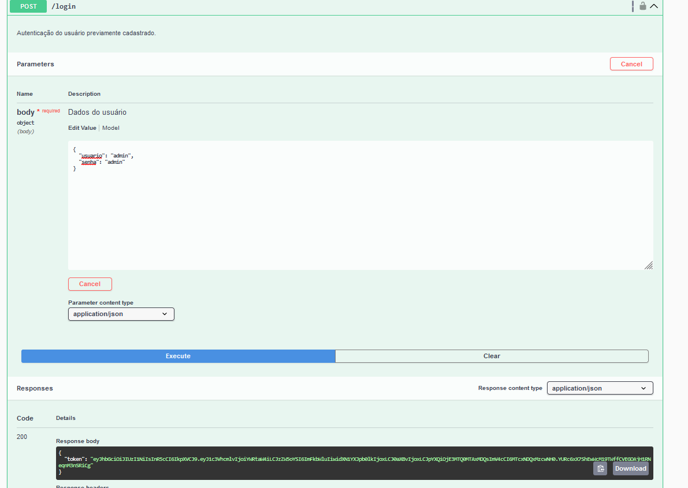
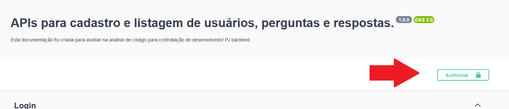
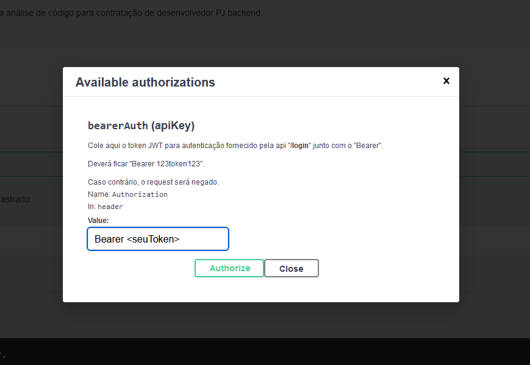
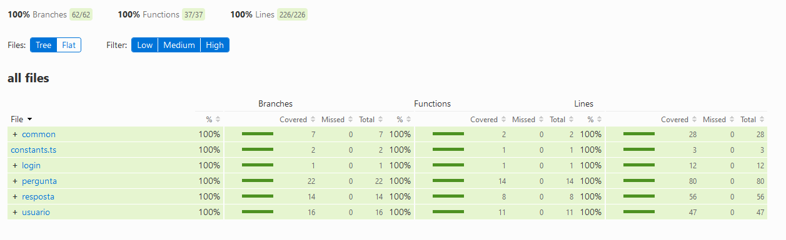

# Requisitos

Vaga de backend para o projeto: https://github.com/Yazo-Connecting-Experiences/Backend-Dev-Challenge

Caso vá executar somente pelo `docker`:  
- Docker

Caso queira executar manualmente:  
- Docker (banco de dados)
- NodeJS - 21.7.3 (versão utilizada por mim para desenvolver)
  

# Guia de como rodar o ambiente.
Criei os arquivos para rodar com os comandos `bash build_projeto.sh (Linux)` e `cmd build_projeto.bat (Windows)` que é somente um `docker-compose up -d`. 

O banco de dados estará na porta `5432`. 
A API pode ser acessada pela porta `3000`. 
Todos os endpoints estão configurados e documentados com o swagger na url `localhost:3000/api-docs`.  

Ao entrar na página do Swagger, faça um request na API `/login`. Existem dois usuários já cadastrados: 
 - O usuário `admin` com senha `admin` é um usuário com permissões de `Organizador`, no caso um usuário tipo `1`. 
 - O usuário `test` com senha `test` é um usuário com permissões de `Participante`, no caso um usuário tipo `2`. 
  

Insira o usuário que deseja verificar o comportamento e emita o request. 
Será retornado o response com o token de autenticação. Esse token deve ser inserido no botão `Authorize` no topo da página. Insira a palavra `Bearer` seguido do token que você acabou de copiar. 
Após isso, clique no botão de autorização e será possível fazer o request em todos os endpoins.
  
  

Para verificar os testes e as coberturas, é necessário executar o projeto manualmente. 
Digite na raiz do projeto `npm test`. Aguarde a execução de todos os testes. 
Após finalizar, navege para `./coverage/index.html` e abra-o no seu navegador. Será apresentado todos os módulos e suas respectivas coberturas (todos estão 100%). 
  

# Explicando as decisões técnicas;
## Dependências
- Node.js - Requisitos da vaga. 
- TypeScript - Requisitos da vaga. 
- PostgreSQL - Requisitos da vaga. 
- Express - Devido ser o mais comum, utilizei para facilitar o entendimento na análise do código. Poderia ter utilizado, por exemplo, o AdonisJS mas devido a não tão conhecido em relação ao Express, fui no mais fácil. 
- Jsonwebtoken - Fornece uma maneira fácil de criar e verificar tokens JWT. Ela suporta a assinatura de tokens com algoritmos HMAC, RSA e ECDSA, e também suporta todas as reivindicações padrão do JWT. 
- PG - Escolhi esta biblioteca por sua leveza e eficiência. Ela atende perfeitamente às necessidades dos CRUDs que foram criados neste projeto, fornecendo uma interface simples e direta para interagir com o PostgreSQL. 
- Swagger - Escolhi esta ferramenta por ser a mais comumente utilizada para documentação de APIs. Ela oferece uma interface amigável e interativa para visualizar e testar a API, facilitando o entendimento e a utilização da mesma. 
- Jest - Escolhi esta biblioteca por ser uma das mais completas ferramentas de teste para TypeScript. Ela oferece testes em paralelo, mock de funções e cobertura de código, que eram as necessárias para utilizar o projeto. 

## Decisões

Rodar tudo por Docker para facilitar a execução em diferentes ambientes. Com apenas um comando você está com tudo rodando. Se eu tivesse utilizado processos standalone, seria necessário toda vez instalar o banco de dados, configurar completamente para depois iniciar o projeto, popular o banco para assim poder começar a ver toda a criação.
Do modo atual, simplesmente é necessário ter conexão com a internet, um Docker e o navegador para acesso ao Swagger. 

Não houve requisito técnico mas me atentei em finalizar 100% dos testes para manter tudo extritamente alinhado. Em qualquer mudança que altere o resultado, os testes irão apontar as diferenças. 

### Endpoints
Fiz a criacão de CRUD para todos os endpoints. Você consegue criar, listar, alterar e deletar qualquer usuário, pergunta ou respostas. 
Inicialmente não iria criar todos pelo simples fato de sem um simples CRUD sem muita diferença entre uma API e outra, mas como isso é um teste para uma vaga (e eu quero passar), fiz a criação completa de todos os endpoints. 

### Endpoint `/pergunta`
Basicamente fiz todas as solicitações requisitadas para o projeto.
Se reparar, existem duas APIs de GET. A explicação está no próximo parágrafo. 

### Endpoint `/resposta`
A listagem (GET) de respostas eu fiz dentro da API de pergunta. Listar todas as respostas juntas acabaria meio esquisito e ficou confuso, então acabei removendo e adicionando o GET de respostas dentro da pergunta, aonde é necessário informar o ID da pergunta, que trará todas as respostas. 

### Endpoint `/usuario`
Nesta API é onde se pode criar novos usuários. 

Optei por retornar apenas o ID do usuário, resposta e pergunta nas solicitações para melhorar a performance da API. Esta abordagem tem duas vantagens principais:

- Redução do tamanho da resposta: Ao retornar apenas o ID, a quantidade de dados que precisam ser transmitidos em cada resposta é significativamente reduzida. Isso pode levar a tempos de resposta mais rápidos e a um uso mais eficiente da largura de banda. 

- Simplificação do processamento do lado do cliente: Ao receber apenas o ID, o cliente pode decidir quando e se precisa de mais informações sobre o usuário, a pergunta ou a resposta. Isso pode levar a um processamento mais eficiente do lado do cliente, pois evita o processamento de dados desnecessários.

Portanto, essa abordagem não só melhora a performance da API, mas também oferece maior flexibilidade para os clientes. Caso fosse optado por retornar os dados completos, seria extremamente tranquilo alterar, visto que basta uma pequena mudança no retorno do JSON.